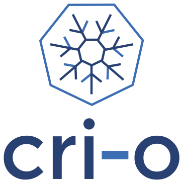

# awesome-cloudnative

- Kube Cluster Deployment Tools
- Monitoring Tools
- Testing
- Security
- Helpful CLI Tools
- Development Tools
- Continuous Integration/ Continuous Delivery Pipeline
- Serverless/Function Tools
- Service Mesh Tools
- Native Service Discovery
- Native Visualization & Control
- Cost Management

### containerd

> An open and reliable container runtime

### CoreDNS

> CoreDNS is a DNS server that chains plugins

### Envoy

> Cloud-native high-performance edge/middle/service proxy

### etcd

> Distributed reliable key-value store for the most critical data of a distributed system

### Fluentd

> Fluentd: Unified Logging Layer (project under CNCF)

### Harbor

> An open source trusted cloud native registry project that stores, signs, and scans content.

### Helm

> The Kubernetes Package Manager

### Jaeger

> CNCF Jaeger, a Distributed Tracing Platform

### Kubernetes

> Kubernetes is an open-source system for automating deployment, scaling, and management of containerized applications

### Linkerd

> Ultralight, security-first service mesh for Kubernetes. Main repo for Linkerd 2.x.

### Open Policy Agent (OPA)

> An open source, general-purpose policy engine.

### Prometheus

> The Prometheus monitoring system and time series database.

### Rook

> Storage Orchestration for Kubernetes

### The Update Framework (TUF)

> Python reference implementation of The Update Framework (TUF)

### TiKV

> A distributed transactional key-value database. Based on the design of Google Spanner and HBase, but simpler to manage and without dependencies on any distributed filesystem

### Vitess

> Vitess is a database clustering system for horizontal scaling of MySQL.

### Argo

> Workflow engine for Kubernetes

### Backstage

> Backstage is an open platform for building developer portals

### Buildpacks

> CLI for building apps using Cloud Native Buildpacks

### Chaos Mesh

> A Chaos Engineering Platform for Kubernetes.

### Cilium

> eBPF-based Networking, Security, and Observability

### CloudEvents

> CloudEvents Specification

### Container Network Interface (CNI)

Container Network Interface - networking for Linux containers

### Contour

Contour is a Kubernetes ingress controller using Envoy proxy.

### Cortex

A horizontally scalable, highly available, multi-tenant, long term Prometheus.

### CRI-O

Open Container Initiative-based implementation of Kubernetes Container Runtime Interface

### Crossplane

Cloud Native Control Planes

### CubeFS

CubeFS is a cloud native distributed storage platform.

### Dapr

Dapr is a portable, event-driven, runtime for building distributed applications across cloud and edge.

### Dragonfly

Dragonfly is an intelligent P2P based image and file distribution system, it also provides a variety of enterprise-level (efficiency, stability, safety, low-cost) product features.

### Emissary-Ingress

open source Kubernetes-native API gateway for microservices built on the Envoy Proxy

### Falco

Cloud Native Runtime Security

### Flagger

Progressive delivery Kubernetes operator (Canary, A/B Testing and Blue/Green deployments)

### Flux

Open and extensible continuous delivery solution for Kubernetes. Powered by GitOps Toolkit.

### gRPC

The C based gRPC (C++, Python, Ruby, Objective-C, PHP, C#)

### Hubble

Hubble - Network, Service & Security Observability for Kubernetes using eBPF

### in-toto

in-toto is a framework to protect supply chain integrity.

### Keda

KEDA is a Kubernetes-based Event Driven Autoscaling component. It provides event driven scale for any container running in Kubernetes

### Keptn

Cloud-native application life-cycle orchestration. Keptn automates your SLO-driven multi-stage delivery and operations & remediation of your applications.

### Knative

Knative is a developer-focused serverless application layer which is a great complement to the existing Kubernetes application constructs. Knative consists of two components: an HTTP-triggered autoscaling container runtime called “Knative Serving”, and a CloudEvents-over-HTTP asynchronous routing layer called “Knative Eventing”.

### KubeEdge

Kubernetes Native Edge Computing Framework (project under CNCF)

### KubeVirt

Kubernetes Virtualization API and runtime in order to define and manage virtual machines.

### Kyverno

Kubernetes Native Policy Management

### Litmus

Litmus helps SREs and developers practice chaos engineering in a Cloud-native way. Chaos experiments are published at the ChaosHub (https://hub.litmuschaos.io). Community notes is at https://hackmd.io/a4Zu_sH4TZGeih-xCimi3Q

### Longhorn

Cloud-Native distributed storage built on and for Kubernetes

### NATS

High-Performance server for NATS.io, the cloud and edge native messaging system.

### Notary

Notary is a project that allows anyone to have trust over arbitrary collections of data

### OpenMetrics

Evolving the Prometheus exposition format into a standard.

### OpenTelemetry

OpenTelemetry community content

### Operator Framework

SDK for building Kubernetes applications. Provides high level APIs, useful abstractions, and project scaffolding.

### SPIFFE

The SPIFFE Project

### SPIRE

The SPIFFE Runtime Environment

### Tetragon

eBPF-based Security Observability and Runtime Enforcement

### Thanos

Highly available Prometheus setup with long term storage capabilities. A CNCF Incubating project.

### Volcano

A Cloud Native Batch System (Project under CNCF)

## sandbox projects

### Aeraki Mesh

Aeraki Mesh allows you to manage any layer-7 traffic in a service mesh

### Akri

A Kubernetes Resource Interface for the Edge

### Antrea

Kubernetes networking based on Open vSwitch

### Artifact Hub

Find, install and publish Kubernetes packages

### Athenz

Open source platform for X.509 certificate based service authentication and fine grained access control in dynamic infrastructures

### BFE

Open-source layer 7 load balancer derived from proprietary Baidu FrontEnd

### Brigade

Event-driven scripting for Kubernetes

### CDK for Kubernetes (CDK8s)

CDK8s lets you define Kubernetes apps and components using familiar programming languages and object-oriented APIs.

### cert-manager

Automatically provision and manage TLS certificates in Kubernetes

### Chaosblade

An easy to use and powerful chaos engineering experiment toolkit.（阿里巴巴开源的一款简单易用、功能强大的混沌实验注入工具）

### Cloud Custodian

Rules engine for cloud security, cost optimization, and governance, DSL in yaml for policies to query, filter, and take actions on resources

### Clusterpedia

Clusterpedia is used for complex resources search across multiple clusters, support simultaneous search of a single kind of resource or multiple kinds of resources existing in multiple clusters.

### CNI-Genie

CNI-Genie for choosing pod network of your choice during deployment time. Supported pod networks - Calico, Flannel, Romana, Weave

### Confidential Containers

Confidential Containers is an open source community working to enable cloud native confidential computing by leveraging Trusted Execution Environments to protect containers and data.

### Curiefense

Curiefense is a unified, open source platform protecting cloud native applications.

### Devfile

Kube-native API for cloud development workspaces specification

### DevStream

DevStream: the open-source DevOps toolchain manager (DTM).

### Dex

OpenID Connect (OIDC) identity and OAuth 2.0 provider with pluggable connectors

### Fluid

Fluid is an orchestration platform for elastic data abstraction and acceleration in cloud native environment.

### Fonio

Data first monitoring agent using (e)BPF, built on RedBPF

### Inclavare Containers

A novel container runtime, aka confidential container, for cloud-native confidential computing and enclave runtime ecosystem.

### k3s

Lightweight Kubernetes

### k8gb

A cloud native Kubernetes Global Balancer

### K8up

Kubernetes and OpenShift Backup Operator

### Karmada

Open, Multi-Cloud, Multi-Cluster Kubernetes Orchestration

### Keylime

CNCF is an open source software foundation that hosts and nurtures projects like Kubernetes and Prometheus.

### Krator

Kubernetes Rust State Machine Operator

### Krustlet

Kubernetes Rust Kubelet

### Kube-OVN

A Bridge between SDN and Cloud Native (Project under CNCF)

### kube-rs

kube-rs is the core Rust ecosystem for building applications against Kubernetes

### KubeArmor

Runtime protection for Kubernetes & other cloud Workloads. Kubearmor provides a observability and policy enforcement system to restrict any unwanted, malicious behaviour of cloud-native workloads at runtime.

### KubeDL

Run your deep learning workloads on Kubernetes more easily and efficiently.

### Kuberhealthy

A Kubernetes operator for running synthetic checks as pods. Works great with Prometheus!

### KubeVela

The Modern Application Platform.

### KUDO

Kubernetes Universal Declarative Operator (KUDO)

### Kuma

The multi-zone service mesh for containers, Kubernetes and VMs. Built with Envoy. CNCF Sandbox Project.

### Meshery

Meshery, the cloud native management plane

### Network Service Mesh

The Hybrid/Multi-cloud IP Service Mesh

### Nocalhost

Nocalhost is Cloud Native Dev Environment.

### Open Cluster Management

Contains useful documentation on the OCM project. Report here if you found any issues in OCM.

### Open Service Mesh

Open Service Mesh (OSM) is a lightweight, extensible, cloud native service mesh that allows users to uniformly manage, secure, and get out-of-the-box observability features for highly dynamic microservice environments.

### OpenCost

OpenCost provides visibility into current and historical Kubernetes spend and resource allocation.

### OpenEBS

Leading Open Source Container Attached Storage, built using Cloud Native Architecture, simplifies running Stateful Applications on Kubernetes.

### OpenELB

Load Balancer Implementation for Kubernetes in Bare-Metal, Edge, and Virtualization

### OpenFeature

Standardizing Feature Flagging for Everyone

### OpenFunction

Cloud Native Function-as-a-Service Platform (CNCF Sandbox Project)

### OpenGitOps

Repository for top-level information about the OpenGitOps project

### OpenKruise

Automate application management on Kubernetes (project under CNCF)

### OpenYurt

An open platform that extending your native Kubernetes to edge.

### ORAS

ORAS CLI

### Parsec

Platform AbstRaction for SECurity service

### Piraeus Datastore

High Available Datastore for Kubernetes

### Pixie

Open source Kubernetes observability for developers

### Porter

Porter enables you to package your application artifact, client tools, configuration and deployment logic together as an installer that you can distribute, and install with a single command.

### Pravega

Pravega - Streaming as a new software defined storage primitive

### SchemaHero

A Kubernetes operator for declarative database schema management (gitops for database schemas)

### sealer

A tool to seal application's all dependencies and Kubernetes into ClusterImage, distribute this application anywhere via ClusterImage, and run it within any cluster in one command.

### Serverless Workflow

Serverless Workflow Specification

### Service Mesh Interface (SMI)

Service Mesh Interface

### Service Mesh Performance

Standardizing Service Mesh Value Measurement

### Skooner

Simple Kubernetes real-time dashboard and management.

### Strimzi

Apache Kafka® running on Kubernetes

### Submariner

Submariner enables direct networking between Pods and Services in different Kubernetes clusters, either on-premises or in the cloud.

### SuperEdge

An edge-native container management system for edge computing

### Telepresence

Local development against a remote Kubernetes or OpenShift cluster

### Teller

A secrets management tool for developers built in Go - never leave your command line for secrets.

### Tinkerbell

A workflow engine for provisioning bare metal.

### Tremor

Main Tremor Project Rust Codebase

### Trickster

Open Source HTTP Reverse Proxy Cache and Time Series Dashboard Accelerator

### Vineyard

Vineyard (v6d) is an in-memory immutable data manager.

### Virtual Kubelet

Virtual Kubelet is an open source Kubernetes kubelet implementation.

### wasmCloud

Project homepage. wasmCloud allows for simple, secure, distributed application development using WebAssembly actors and capability providers.

### WasmEdge Runtime

WasmEdge is a lightweight, high-performance, and extensible WebAssembly runtime for cloud native, edge, and decentralized applications. It powers serverless apps, embedded functions, microservices, smart contracts, and IoT devices.

